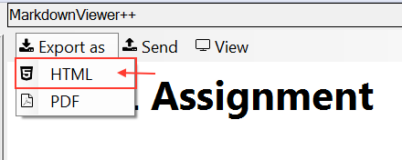

# MarkdownViewer++ PDF Workarounds

There are two known bugs when dealing with images using the NotePad++ MarkdownViewer++ plugin.

## Known Bugs

1. Images will not display using relative file paths. [#38](https://github.com/nea/MarkdownViewerPlusPlus/issues/38)

	A very kludgy workaround is to add `file:///` plus the absolute file path to the image file.  This will allow you to see images in the MarkdownViewer++ plugin window.

	**WARNING**: Do not upload files to GitHub using the absolute paths.  The image links will be broken on GitHub.

1. Exporting the PDF directly from the MarkdownViewer++ plugin will not resize images properly and large images will be clipped.

## Suggested Workaround

1. Write the MarkDown document normally, leaving the image links broken in the plug-in viewer.

1. Preview the document using the HTML export option.

	1. Select **Export as** -> **HTML** from the MarkdownViewer++ menubar.

		

	1. Save the HTML file in the same directory as the Markdown document.

	1. Open the HTML file in Chrome or Firefox.

		The HTML file will be rendered using relative file paths so the images should be found and displayed.  The images will also be sized properly for the page so they won't be clipped.
	
1. Generate the PDF from the HTML file rendered in the web browser.

	1. From the web browser, select **Print**.
	2. Change the Destination printer to **Save as PDF**.
	3. Then click **Save** to output the PDF.

